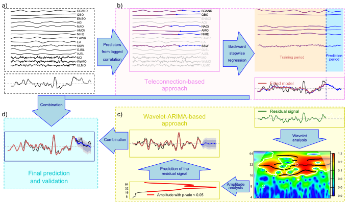

Teleconnection and Wavelet-Arima (TeWA) approach
================

Darío Redolat and Robert Monjo
8 September de 2022 (updated 16 January 2024)

## Abstract

The TeWA code provides a complementary method to predict seasonal anomalies by supposing that (1) delayed teleconnection patterns inform about the ocean–atmosphere coupling on a subseasonal timescale through the lens of (2) partially predictable quasi-periodic oscillations since (3) forecast signal can be extracted by smoothing noise in a continuous lead time horizon. The method consists of combining lag-correlated teleconnections (a total of 15 indices) with self-predictability techniques of residual quasi-oscillation based on Wavelet (cyclic) and ARIMA (linear) analyses. Prediction skill of the Teleconnection-Wavelet-ARIMA (TeWA) combination was cross-validated and compared to that of the SEAS5-ECMWF model (90 days ahead), and shown in Redolat and Monjo (2024).

This repository contains material to support an application example of subseasonal forecasting:
- Data: 
  * Time series of teleconnections indices, selected as predictors.
  * Time series of the (past) observed variable, the target to predict.
  * Time series of the (future) observed variable, to validate the prediction.
- R code:
  * List of TeWA functions
  * Example to apply the functions by using the above data.

<!-- -->

## How to cite

Redolat, D.; Monjo. R, (2024): Ocean-atmosphere coupling can statistically predict Mediterranean subseasonal anomalies: The TeWA approach. Weather and Forecasting (under review).
